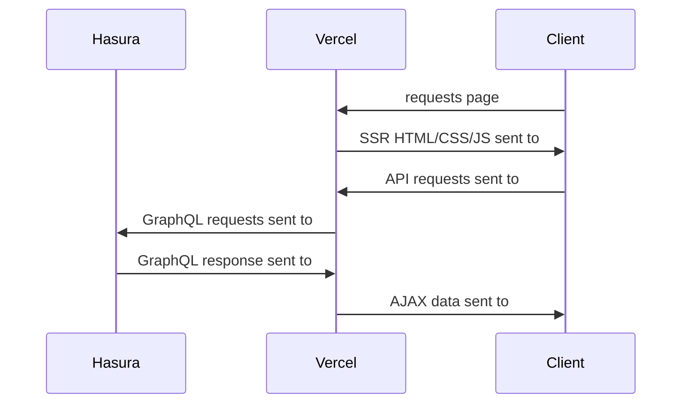
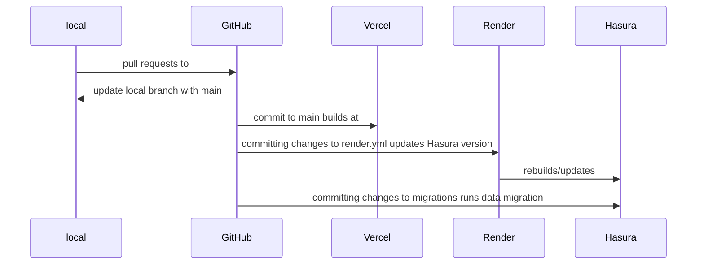

# Infinity Keys

Required tools:

1. Node 16 ([install via nvm](https://github.com/nvm-sh/nvm#install--update-script))
2. yarn (`npm install -g npm`)

# Tech Stack

- Domain name registered through (@TODO)
- DNS managed through [CloudFlare](https://dash.cloudflare.com/4f274c5408ad8bb23f50152e1753f153/infinitykeys.io/dns)
- Static hosting/CDN through [Vercel](https://vercel.com/infinity-keys)
- Hasura GraphQL and Postgres managed through render.com (@TODO)

## Runtime flow



## Dev flow



# Development workflow

1. All code starts from a [Linear](https://linear.app/infinity-keys/team/ENG/active) ticket. If a Linear ticket is not available, create one.
2. From the Linear ticket click the "copy git branch name to clipboard" icon in the upper right corner
3. Create a new branch **off of `main`** with the name you just copied: `git checkout -b {paste name of branch here}`
4. Write some code according to your ticket description. Commit as you see fit at atomic, functioning points in your process.
5. Create pull requests. Consider using the [GitHub CLI](https://cli.github.com/) to greatly streamline this.
6. Ensure the title of your pull request follows this pattern: `ENG-{linear ticket number}: simple description of your work that could be read by a customer`
   1. For instance, if you have Linear ticket `ENG-123` and the ticket description is something like "integrate auth0", you'd make a PR title that looks like "ENG-123: users can now sign in with user name and password through auth0" (or something like that)
7. If there are no conflicts in your pull request, your code will start to build at Vercel. Click the "Show environments" dropdown then the "View deployment" link to see the frontend of the site as it exists entirely at the state of your branch.
8. Merge `main` into your work often.

# Database

All interactions with the database must run through the local hasura console

1. Ensure you've [installed the Hasura CLI](https://hasura.io/docs/latest/hasura-cli/install-hasura-cli/).
1. Run `npm run hasura:console` to start up a local UI against the database that will track changes made as code

# NextJs

This is a [Next.js](https://nextjs.org/) project bootstrapped with [`create-next-app`](https://github.com/vercel/next.js/tree/canary/packages/create-next-app).

## Getting Started

First, run the development server:

```bash
yarn dev
```

Open [http://localhost:3000](http://localhost:3000) with your browser to see the result.

You can start editing the page by modifying `pages/index.tsx`. The page auto-updates as you edit the file.

[API routes](https://nextjs.org/docs/api-routes/introduction) can be accessed on [http://localhost:3000/api/hello](http://localhost:3000/api/hello). This endpoint can be edited in `pages/api/hello.ts`.

The `pages/api` directory is mapped to `/api/*`. Files in this directory are treated as [API routes](https://nextjs.org/docs/api-routes/introduction) instead of React pages.

## Learn More

To learn more about Next.js, take a look at the following resources:

- [Next.js Documentation](https://nextjs.org/docs) - learn about Next.js features and API.
- [Learn Next.js](https://nextjs.org/learn) - an interactive Next.js tutorial.

You can check out [the Next.js GitHub repository](https://github.com/vercel/next.js/) - your feedback and contributions are welcome!

## Deploy on Vercel

The easiest way to deploy your Next.js app is to use the [Vercel Platform](https://vercel.com/new?utm_medium=default-template&filter=next.js&utm_source=create-next-app&utm_campaign=create-next-app-readme) from the creators of Next.js.

Check out our [Next.js deployment documentation](https://nextjs.org/docs/deployment) for more details.

# Infinity Keys specific

## favicon

Generated using `/public/logo.svg`, run through [favicon.io](https://favicon.io/favicon-converter/), and dropped back into `/public`.
